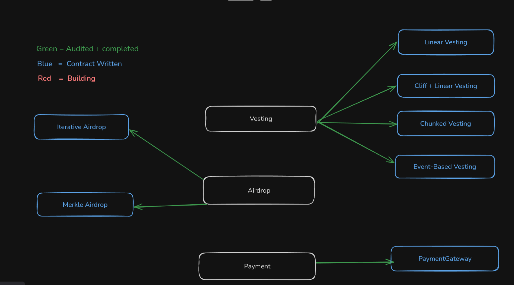

## Alpha-Block

This repository contains a small suite of vesting and airdrop contracts, plus a helper payment utility. The smart contracts are located under the `src/` folder. Below is a short, file-by-file explanation to help you navigate the codebase.

## Intended Use — Reuse & Inheritance

This project is designed as a small, reusable library developers can inherit and adapt into their own projects. The contracts provide common vesting and airdrop patterns so you don't need to reimplement them from scratch — simply extend or compose them and change a few parameters.

Quick guidance:
- Import the contract you want to reuse and inherit from it.
- Update constructor arguments (beneficiary, token, price feed) in your deployment script or child contract.
- Override any virtual functions or add new access controls as needed for your application.

Recommendations before reuse:
- Run `forge build` and `forge test` after changing imports or remappings.
- Use OpenZeppelin's `SafeERC20` when integrating token transfers.
- Review and adapt access control (`owner` / `onlyOwner`) to your project's governance.

---

**`Interface`** (interfaces)
- `ICliffTypeVesting.sol`: Interface for cliff-style vesting contracts (function signatures and events expected from cliff  vesting implementations).
- `ILinearVesting.sol`: Interface for linear vesting implementations.
- `ILoopAirDrop.sol`: Interface describing loop airdrop functions and events.
- `IMerkleAirDrop.sol`: Interface describing Merkle airdrop claim function and events.
- `ITimeVesting.sol`: Interface for time/step-based vesting contracts.
- `IUsdcUsdtPay.sol`: Interface for the payments utility (`UsdcUsdtPay`) describing price conversion helpers.

---

